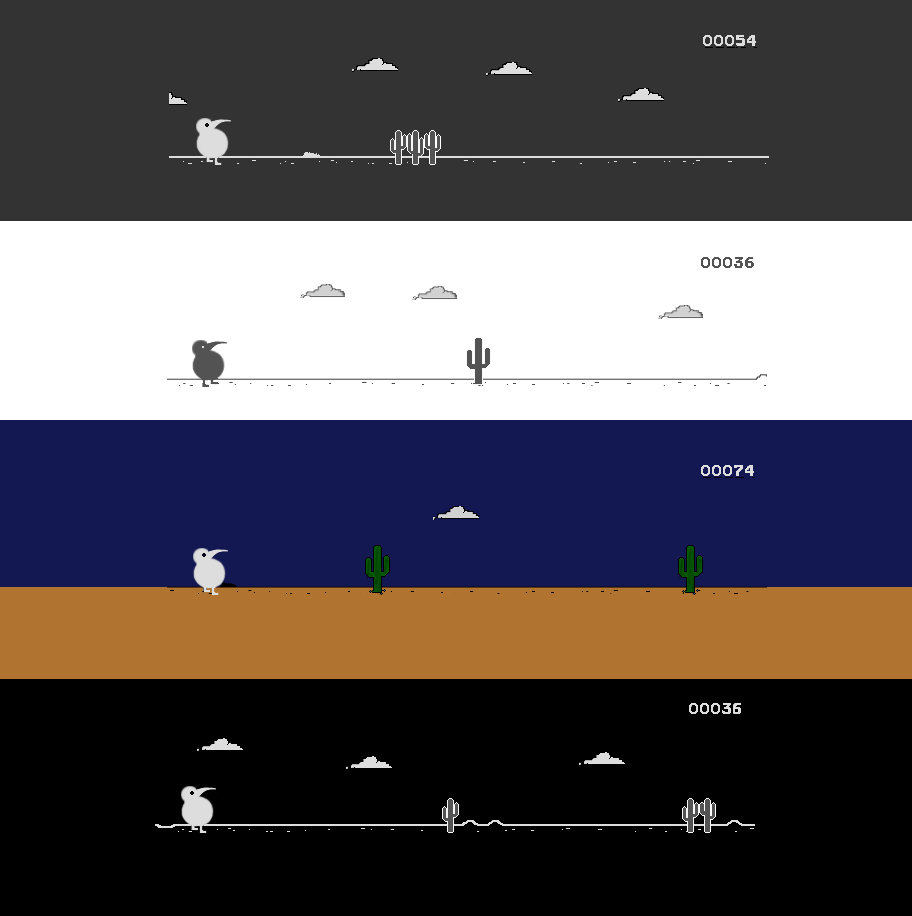

# Apteryx Game

A modified version of the t-rex runner game from chrome offline err page.
This version instead of t-rex has a Kiwi bird , from the genus [Apteryx](https://en.wikipedia.org/wiki/Kiwi)

[Play !](https://d3ward.github.io/Apteryx-Game/)

## Preview

### Changelog

#### [1.1] _04/05/2020_

* Fixed game on desktop mode
* Improved the quality of the sprites
* Added history of scores
* Added AMOLED theme, now there are 4 ( Classic, Dark , Amoled and Colorful)

#### [1.0] _24/08/2019_

* Replace t-rex with Kiwi bird sprite
* Added 3 themes : Classic, Dark, Colorful
* Adding button to switch between themes

_The classic theme of this game is included in [Kiwi Browser](https://kiwibrowser.com)_
____
All rights of the original game's code belong to the Chromium team. [Source from Chromium](https://cs.chromium.org/chromium/src/components/neterror/resources/offline.js?q=t-rex+package:%5Echromium$&dr=C&l=7)

Thanks to [Wayou Liu](https://github.com/wayou) for extracting the game from Chrome's files and making it available on Github - [Link to original repository](https://github.com/wayou/t-rex-runner).
